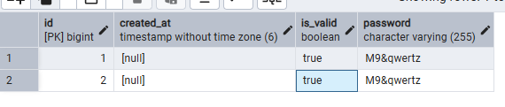
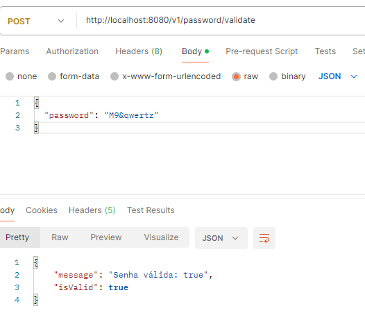

# Desafio de Validação de Senhas - API Spring Boot

Esta é uma solução para o desafio de validação de senhas, desenvolvida como parte de um processo seletivo para Desenvolvedor Junior. A aplicação expõe um endpoint REST que verifica se uma senha atende a critérios rigorosos de segurança.

##  Tecnologias Utilizadas
- **Java 17+**
- **Spring Boot 3.x**
- **Maven**
- **PostgreSQL (Persistência de dados)**
- **Spring Data JPA (ORM)**
- **Mockito & JUnit 5** (Testes Unitários)

##  Critérios de Validação
A senha é considerada válida se possuir:
1. Nove ou mais caracteres.
2. Ao menos 1 dígito.
3. Ao menos 1 letra minúscula.
4. Ao menos 1 letra maiúscula.
5. Ao menos 1 caractere especial (`!@#$%^&*()-+`).
6. **Não possuir caracteres repetidos** (Case-sensitive).
7. Não possuir espaços em branco.

##  Arquitetura e Boas Práticas
- **SOLID:** Aplicação do Princípio de Responsabilidade Única (SRP).
- **Clean Code:** Nomenclatura de métodos e variáveis clara e semântica.
- **DTO Pattern:** Uso de `Records` para transferência de dados entre camadas.
- **Injeção de Dependência:** Desacoplamento entre o Controller e o Service.
- **Coesão e Acoplamento:** Lógica de negócio isolada na camada de serviço, facilitando a manutenção e testes.
- **Utilização de log:** Utilização de log no código para visualizar tipos de erros no terminal.
- **Persistência & Auditoria:** Histórico de validações salvo no banco de dados com timestamp.
- **Testes com Mocks:** Uso do Mockito para isolar o PasswordService de dependências externas durante os testes unitários.


## Persistência de Dados (PostgreSQL)
### A aplicação registra cada tentativa no banco desafioitau
- **Tabela:** th_password_history (ou tb_password_history).
- **Campos:** id, password, is_valid, created_at. 

A API foi integrada ao PostgreSQL para garantir a rastreabilidade das operações. Cada tentativa de validação é persistida automaticamente, permitindo auditorias futuras e análise de padrões de senhas.
- Tecnologias: Spring Data JPA & Hibernate.
- Padrão de Projeto: Repository Pattern para isolamento da camada de acesso a dados.
- Gestão de Schema: Utilização do Hibernate DDL para sincronização automática entre Entidades Java e Tabelas SQL.

Estrutura da Tabela (th_password_history):

| Campo | Tipo | Descrição |
| :--- | :--- | :--- |
| **id** | BIGINT | Identificador único (Primary Key). |
| **password** | VARCHAR | Conteúdo da senha validada. |
| **is_valid** | BOOLEAN | Status do resultado (True para aprovada). |
| **created_at** | TIMESTAMP | Registro temporal da validação. |

## Como Testar a API
### Estar na raíz de teste
- .\mvnw test

## Como rodar a API
- DesafioItauApplication - É onde está nosso SpringBootApplication que vai inicializar tudo o que foi construído.
- Precisa estar na raiz que é a pasta: cd DesafioItau
- E roda: .\mvnw spring-boot:run


## Como Rodar Localmente (Banco de Dados)
spring.datasource.url=jdbc:postgresql://localhost:5432/desafioitau

spring.datasource.username=seu_usuario

spring.datasource.password=sua_senha

# Resultado do BD:


 
### 1. Validar Senha (POST)
### Abrir o url no postman para testar
**URL:** `http://localhost:8080/v1/password/validate`  
**Body (JSON):**
```json
{
  "password": "Ps2@fghjk"
}
```
### Resposta:
**Body (JSON):**
````json
{
  "message": "Senha válida: true",
  "isValid": true
}
````



### 2. Teste de Funcionamento (GET)
**URL:** `http://localhost:8080/v1/password/hello`  
**Body (Text):**
```text
Olá mundo. 
```

### ESCOLHA DE LINGUAGEM E ESQUELETO:
- Escolhi o Java por ser 100% orientado a objetos, ser uma linguagem na qual eu estou me aperfeiçoando, e eu poder dividir os requests e response separadamente no DTO para ter melhor compreensão dos dados que vão ser solicitados e respondidos através da API (Controller). Deixo os comentários em todas as pastas para ficar melhor o entendimento do que eu pensei em fazer.

- Criei um Service para ter a regra de negócios separadas do Controller que é o que controla as ações da minha API com base no que eu criei no DTO, Service. No service eu realizei as validações necessárias para verificar as senhas que serão passadas, o que são nulos, falso etc, utilizei métodos do próprio java para validações criando um loop para isso e retornando o que precisa pra ser true:
hasDigit && hasLower && hasUpper && hasSpecial.

- No DTO criei um response para criar uma classe que me retorne a resposta se é um boolean ou não e a mensagem que eu queria que tivesse para o usuário e um request para solicitar uma senha e o record é para dizer que ali será um JSON.

- No Controller criei uma rota para verificar no terminal com o log se estaria passando, coloquei log pra verificar no terminal como não temos frontend é assim que verifico que se está funcionando algo quando estou ligando o backend e testando no postman.

- Em seguida uma rota POST pois o usuário vai escrever a senha para validação, utilizei o ResponseEntity<PasswordResponse> para que possa validar o body da tratativa e me retornar a mensagem e se é valida ou não.
  
- Temos testes também para que possamos testar cada uma das rotas. Principalmente a rota da senha tanto a qual precisa ser válida e inválida também. 

- Utilizei o teste mockito para utilização do banco de dados e o JPARepository.

### Estratégia de Testes Automatizados:
- JUnit 5: Framework principal para execução dos testes.

- Mockito: Utilizado para criar Mocks do PasswordRepository. Isso permite testar o PasswordService de forma isolada, simulando o comportamento do banco de dados na memória.

- Testes Parametrizados: Uso de @ParameterizedTest para validar múltiplos cenários de senhas inválidas em um único método, aumentando a cobertura de código com menor verbosidade.

### Exemplo de Consulta para Auditoria:
- Verificar as últimas 10 senhas validadas com sucesso:

SELECT * FROM th_password_history
WHERE is_valid = true
ORDER BY created_at DESC
LIMIT 10;
